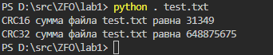

# Лабораторная работа 1

### Задание:

Определить контрольную сумму заданного файла с помощью изученного и реализованного алгоритма:

* CRC-16
* CRC-32

### Результат:

[Код программы](__main__.py)

