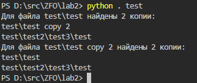

# Лабораторная работа 2

### Задание:

Разработать программу, позволяющую сканировать дерево каталогов (начиная с заданной директории) и детектировать файл (все его копии) по заданной:

* Сигнатуре
* хэш-коду

### Результат:

[Код программы](__main__.py)

